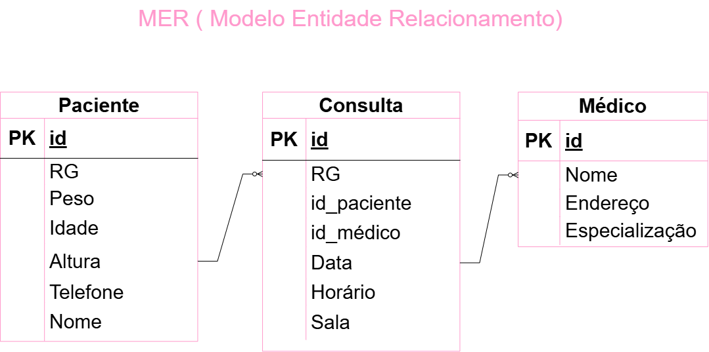
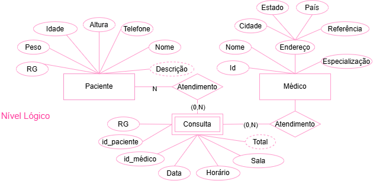

# Projeto: Clinica - banco de dados

## Dicionário de Dados

| Entidade      | Atributo         | Tipo    | Tamanho | Descrição                            |
| ------------- | ---------------- | ------- | ------- | ------------------------------------ |
| Paciente      | id               | INT     | -       | Identificador único do paciente      |
| Paciente      | nome             | VARCHAR | 100     | Nome completo do paciente            |
| Paciente      | RG               | VARCHAR | 14      | RG do paciente                       |
| Paciente      | idade            | INT     | -       | Idade de nascimento                  |
| Paciente      | telefone         | VARCHAR | 20      | Telefone do paciente                 |
| Paciente      | altura           | DECIMAL | 10,2    | Altura do paciente                   |
| Paciente      | peso             | DECIMAL | 10,2    | Peso do paciente                     |
| Médico        | id               | INT     | -       | Identificador único do médico        |
| Médico        | nome             | VARCHAR | 100     | Nome completo do médico              |
| Médico        | endereço         | VARCHAR | 20      | Endereço da consulta com o médico    |
| Médico        | especialização   | VARCHAR | 20      | Especialização do médico             |
| Consulta      | id               | INT     | -       | Identificador único da consulta      |
| Consulta      | data             | DATE    | -       | Data da consulta                     |
| Consulta      | horario          | TIME    | -       | Horário da consulta                  |
| Consulta      | sala             | VARCHAR | 30      | Sala da consulta                     |
| Consulta      | id_paciente      | INT     | -       | Paciente relacionado à consulta      |
| Consulta      | id_medico        | INT     | -       | Médico responsável pela consulta     |

## Dados de teste em CSV
- [animal.csv](./animal.CSV)
- [consulta.csv](./consulta.CSV)
- [dono.csv](./dono.CSV)
- [veterinario.csv](./veterinario.CSV)
