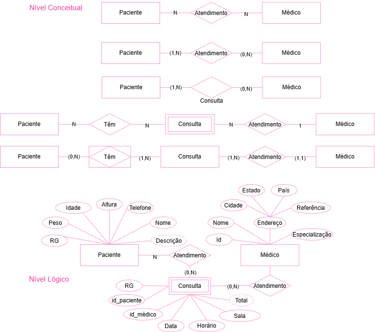

# Projeto: Clinica - banco de dados

## Dicionário de Dados

| Entidade      | Atributo         | Tipo    | Tamanho | Descrição                            |
| ------------- | ---------------- | ------- | ------- | ------------------------------------ |
| Paciente      | id               | INT     | -       | Identificador único do paciente      |
| Paciente      | nome             | VARCHAR | 100     | Nome completo do paciente            |
| Paciente      | cpf              | VARCHAR | 14      | CPF do paciente                      |
| Paciente      | data_nascimento  | DATE    | -       | Data de nascimento                   |
| Paciente      | telefone         | VARCHAR | 20      | Telefone do paciente                 |
| Paciente      | email            | VARCHAR | 100     | E-mail do paciente                   |
| Médico        | id               | INT     | -       | Identificador único do médico        |
| Médico        | nome             | VARCHAR | 100     | Nome completo do médico              |
| Médico        | crm              | VARCHAR | 20      | Registro profissional do médico      |
| Médico        | telefone         | VARCHAR | 20      | Telefone do médico                   |
| Médico        | email            | VARCHAR | 100     | E-mail do médico                     |
| Médico        | id_especialidade | INT     | -       | Especialidade do médico              |
| Especialidade | id_especialidade | INT     | -       | Identificador único da especialidade |
| Especialidade | nome             | VARCHAR | 100     | Nome da especialidade                |
| Consulta      | id               | INT     | -       | PK    | Identificador único da consulta      |
| Consulta      | data_consulta    | DATE    | -       | -     | Data da consulta                     |
| Consulta      | horario          | TIME    | -       | -     | Horário da consulta                  |
| Consulta      | sala             | VARCHAR | 30      | -     | Situação da consulta                 |
| Consulta      | id_paciente      | INT     | -       | FK    | Paciente relacionado à consulta      |
| Consulta      | id_medico        | INT     | -       | FK    | Médico responsável pela consulta     |

## Dados de teste em CSV
- [animal.csv](./animal.csv)
- [consulta.csv](./consulta.csv)
- [dono.csv](./dono.csv)
- [veterinario.csv](./veterinario.csv)
